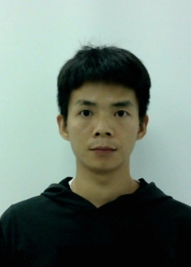
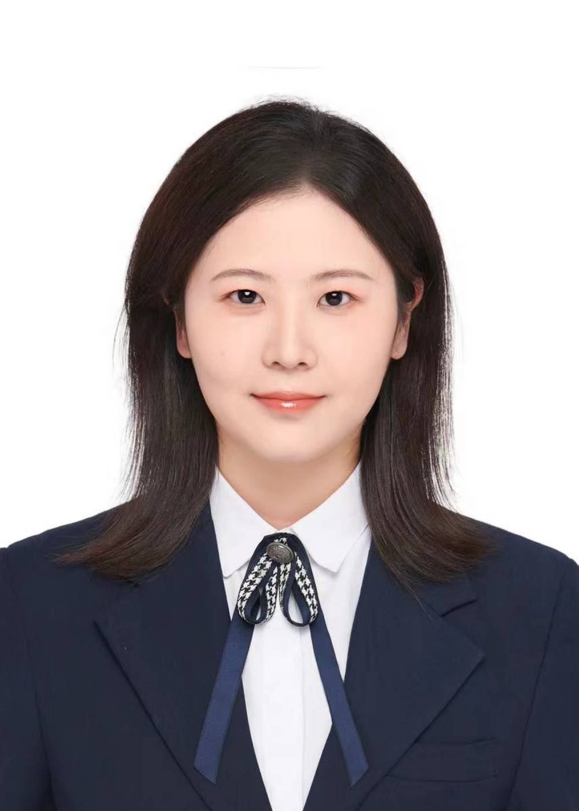
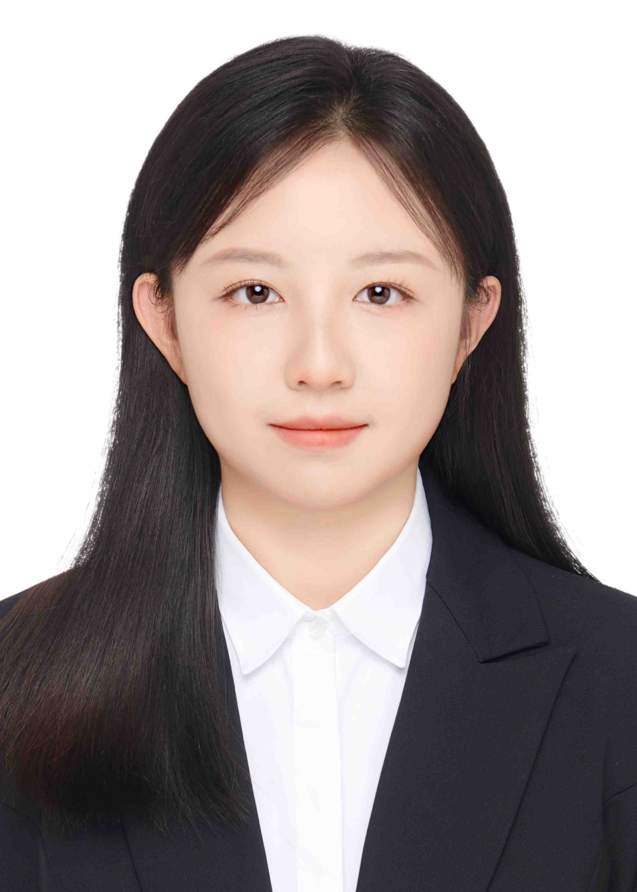
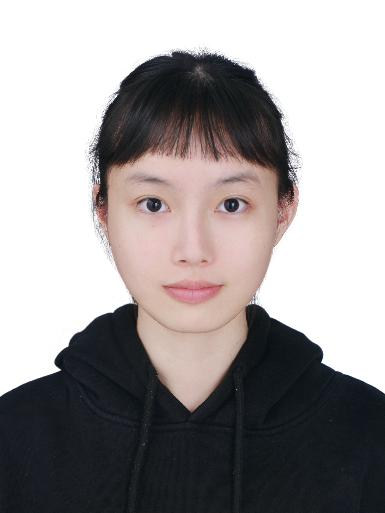
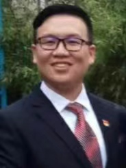

```{r setup, include=FALSE}
knitr::opts_chunk$set(echo = TRUE)
```


<p style="font-size: 20px;">  &nbsp; <a href="index.html">Zhou's lab</a>&nbsp; &nbsp; &nbsp; <a href="news.html">News</a>&nbsp; &nbsp; &nbsp; <a href="publications.html">Publications</a>&nbsp; &nbsp; &nbsp; <a href="people.html">People</a></p>

-------


<div align="left"><table rules="none"><tr>
<td><a href="./people/zhxqcv_en.html"> </a></td>
<td><p>Xinqi Zhou</p><p>Primary Investigator</p></td>
</tr></table></div>

&nbsp;

### Current Members

<div align="left"><table rules="none"><tr>
<td></td>
<td><p>Changchun Liu</p><p>Graduate Student (2022)</p><p style="max-width: 350px;">Research Interests: The influence of emotion on decision-making behavior under uncertain conditions</p></td>

<td></td>
<td><p>Yuchun Li</p><p>Graduate Student (2023)</p><p style="max-width: 350px;">Research Interests: Social decision-making and social competition</p></td>
</tr></table></div>

&nbsp;

<div align="left"><table rules="none"><tr>
<td></td>
<td><p>Liuqing Jiang</p><p>Graduate Student (2023)</p><p>E-mail: 20232491004@stu.sicnu.edu.cn</p><p style="max-width: 350px;">Research Interests: Internet addiction, motivation, and effort</p></td>

<td></td>
<td><p>Tingran Chen</p><p>Graduate Student (2024)</p><p style="max-width: 350px;">Research Interests:</p></td>
</tr></table></div>

&nbsp;

<div align="left"><table rules="none"><tr>
<td></td>
<td><p>Jingrong Tian</p><p>Graduate Student (2024)</p><p style="max-width: 350px;">Research Interests: Cyber psychology and internet violence</p><p style="max-width: 350px;">Love succulent, aquarium, coffee, and reading</p></td>
</tr></table></div>

&nbsp;

### Lab Alumni