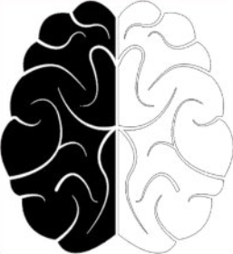
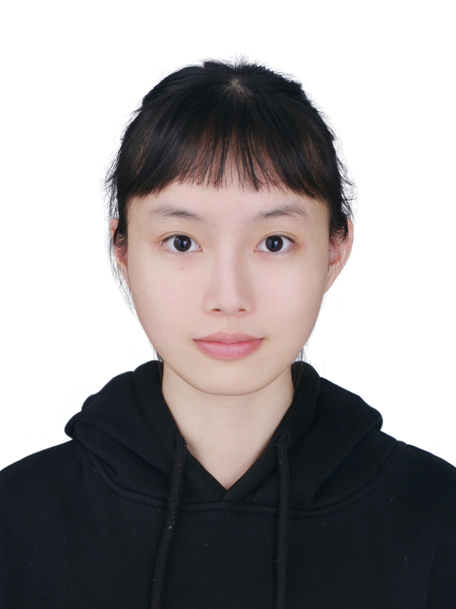
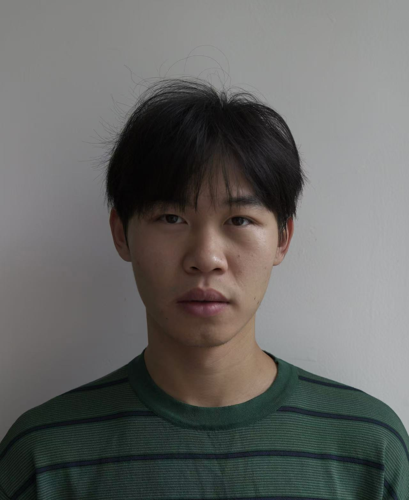
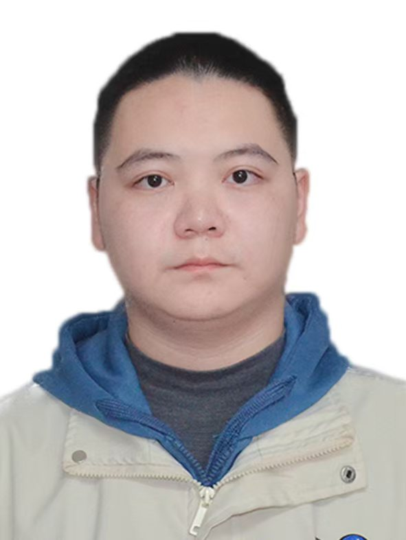
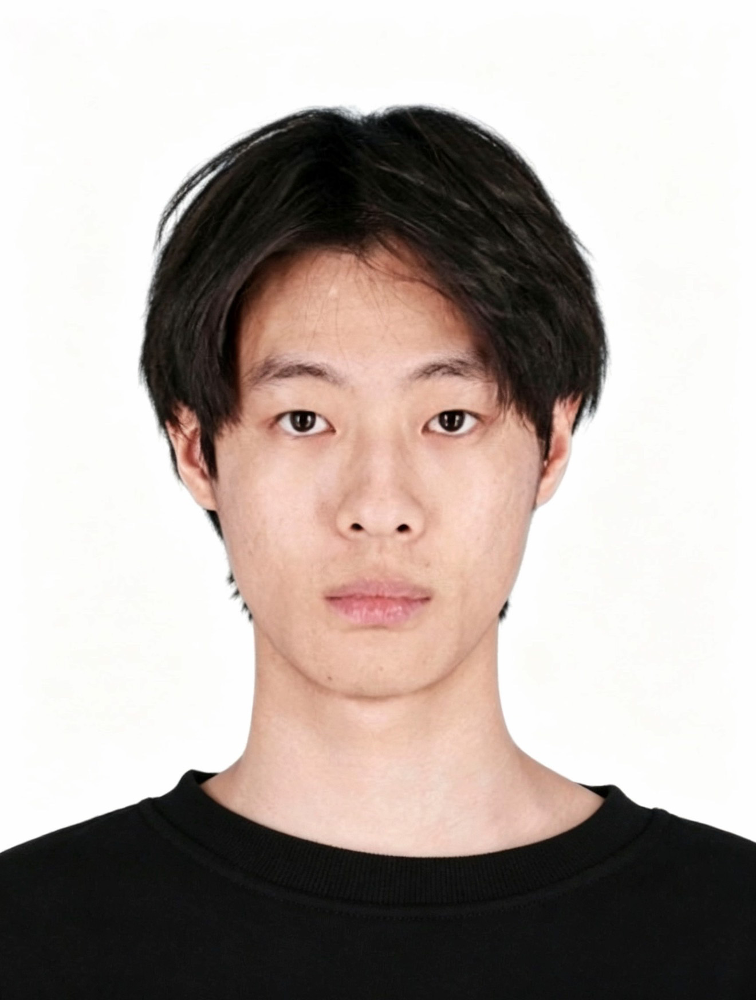

```{r setup, include=FALSE}
knitr::opts_chunk$set(echo = TRUE)
```

<meta name="viewport" content="width=device-width, initial-scale=1.0"><style> .member-row { display: flex; flex-wrap: wrap; align-items: flex-start; gap: 1.5rem 2rem; } .member-row > table { flex: 0 0 auto; max-width: 100%; } @media (max-width: 700px) { .member-row { gap: 1.2rem; } .member-row > table { flex: 1 1 100%; } } </style>

<p style="font-size: 20px;">  &nbsp; <a href="index.html">Zhou's lab</a>&nbsp; &nbsp; &nbsp; <a href="news.html">News</a>&nbsp; &nbsp; &nbsp; <a href="publications.html">Publications</a>&nbsp; &nbsp; &nbsp; <a href="people.html">People</a></p>

-------


<div align="left"><table rules="none"><tr>

<td><a href="./people/zhxqcv_en.html"> </a></td>
<td>
<p>Xinqi Zhou</p>
<p>Primary Investigator</p>
</td>

</tr></table></div>

&nbsp;

### Current Members

<div align="left" class="member-row"><table rules="none"><tr>

<td></td>
<td>
<p>Tingran Chen</p>
<p>Graduate Student (2024)</p>
<p style="max-width: 350px;">I'm a feminist, queer. My research interests are decison-making, emotion, and reward. My hobbies are running, biking, dancing, music, and puzzle game.</p>
</td>

<td></td>
<td>
<p>Jingrong Tian</p>
<p>Graduate Student (2024)</p>
<p style="max-width: 350px;">Research Interests: Cyber psychology and internet violence</p>
<p style="max-width: 350px;">Love succulent, aquarium, coffee, and reading</p>
</td>

</tr></table></div>

&nbsp;

<div align="left" class="member-row"><table rules="none"><tr>

<td></td>
<td>
<p>Yuping Xiong</p>
<p>Graduate Student (2025)</p>
<p style="max-width: 350px;">Research Interests: AI  interaction, decision-making   </p>
</td>

<td></td>
<td>
<p>Mingrui Zhang</p>
<p>Graduate Student (2025)</p>
<p style="max-width: 350px;">Research Interests: decision-making                     </p>
<p style="max-width: 350px;">My hobbies are music, photography, movie.</p>
</td>

</tr></table></div>

&nbsp;

<div align="left" class="member-row"><table rules="none"><tr>

<td></td>
<td>
<p>Zhiqi Kang</p>
<p>Graduate Student (2026)</p>
<p style="max-width: 350px;">Research Interests: human-AI interaction                      </p>
<p style="max-width: 350px;">Hobbies: cooking</p>
</td>

<td></td>
<td>
<p>Jiajun Ren</p>
<p>Graduate Student (2026)</p>
<p style="max-width: 350px;">Research Interests: human-AI interaction, decision-making</p>
</td>

</tr></table></div>

&nbsp;

<div align="left" class="member-row"><table rules="none"><tr>

<td></td>
<td>
<p>Zhenhao Shou</p>
<p>Graduate Student (2026)</p>
<p style="max-width: 350px;">Research Interests: Human-AI interaction and decision-making</p>
<p style="max-width: 350px;">My hobbies are hiking and climbing the moutains.</p>
</td>

<td></td>
<td>
<p>Mengze Sun</p>
<p>Graduate Student (2026)</p>
<p style="max-width: 350px;">Research Interests: Human computer interaction and social decision-making, mainly including the psychological and neural mechanisms in the process of human AI collaboration</p>
<p style="max-width: 350px;">Personal hobbies: reading, handmade crafts</p>
</td>

</tr></table></div>

&nbsp;

### Lab Alumni

<div align="left" class="member-row"><table rules="none"><tr>

<td></td>
<td><p>Changchun Liu</p><p>Graduate Student (2022)</p><p style="max-width: 350px;">Research Interests: The influence of emotion on decision-making behavior under uncertain conditions</p></td>

</tr></table></div>

<div align="left" class="member-row"><table rules="none"><tr>

<td></td>
<td>
<p>Yuchun Li</p>
<p>Graduate Student (2023)</p>
<p style="max-width: 350px;">Research Interests: Social decision-making and social competition</p>
</td>

<td></td>
<td>
<p>Liuqing Jiang</p>
<p>Graduate Student (2023)</p>
<p style="max-width: 350px;">Research Interests: Internet addiction, motivation, and effort</p>
</td>

</tr></table></div>


