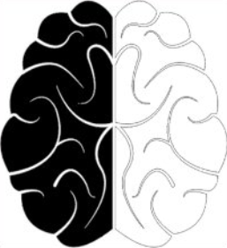

```{r setup, include=FALSE}
knitr::opts_chunk$set(echo = TRUE)
```


<p style="font-size: 20px;">  &nbsp; <a href="../index.html">Zhou's lab</a>&nbsp; &nbsp; &nbsp; <a href="../news.html">News</a>&nbsp; &nbsp; &nbsp; <a href="../publications.html">Publications</a>&nbsp; &nbsp; &nbsp; <a href="../people.html">People</a></p>

-------

[English](zhxqcv_en.html)

周鑫岐，博士，副研究员，硕士生导师。

邮箱：[zhxq\@sicnu.edu.cn](mailto:zhxq@sicnu.edu.cn){.email}

个人学术网站：[ORCID](https://orcid.org/0000-0002-5032-9141)，[ResearchGate](https://www.researchgate.net/profile/Xinqi-Zhou)，[Google Scholar](https://scholar.google.com/citations?user=t15ZMkQAAAAJ&hl=en)

### 工作经历

2024.07-至今 四川师范大学，脑与心理科学研究院，副研究员

2022.02-2024.07 四川师范大学，脑与心理科学研究院，助理研究员

### 教育经历

2017.09 -- 2021.12 电子科技大学，生物医学工程，博士

2014.09 -- 2017.06 西南大学，基础心理学，硕士

2009.09 -- 2013.07 太原科技大学，应用心理学，学士

### 科研项目

主持：国家自然科学基金委员会，青年科学基金项目，32300905，社交媒体依赖行为习得与干预的认知神经计算机制研究，2024-01-01至2026-12-31，30万元

主持：四川省自然科学基金，2023NSFSC1185，基于机器学习解码视听通道诱发愉悦感的神经表征研究，2023-01-01至2024-12-31

主持：认知与人格教育部重点实验室（西南大学）开放课题，2023-12-01至2026-11-30


参与：国家自然科学基金委员会，面上项目，62173069，解释偏向介导抑郁症自杀意念的神经机制研究，2022-01-01至2025-12-31，57万元

参与：四川省自然科学基金，基于情绪模仿训练改善孤独症儿童社会功能的研究，2022-01-01至2023-12-31

参与：国家自然科学基金委员会，面上项目，61976045，大脑沟回褶皱的"功能互补理论"研究，2020-01-01至2023-12-31，61万元

参与：科技部国家重点研发计划，子课题，2018YFA0701403，特定脑神经环路调控方法，2019-09至2024-08，255万元
